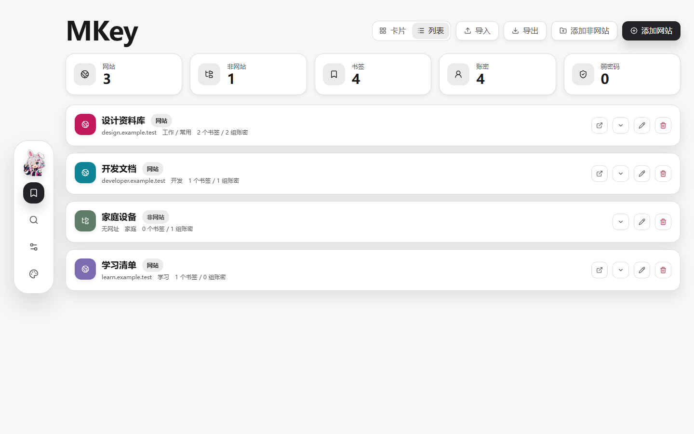
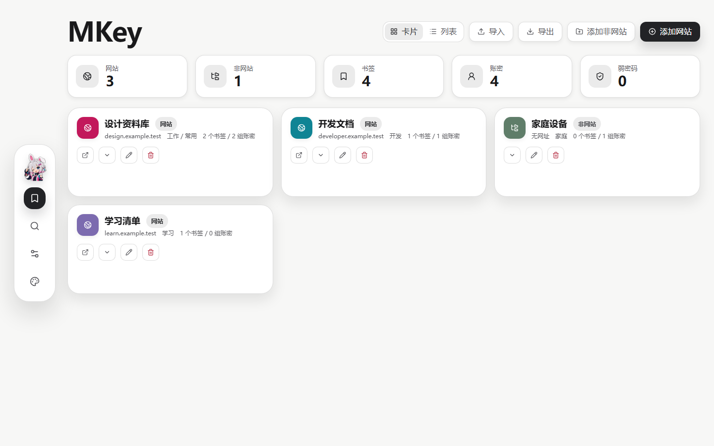
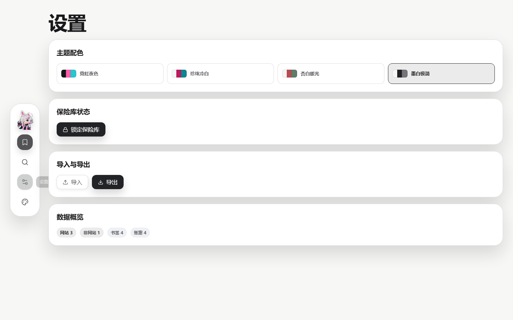
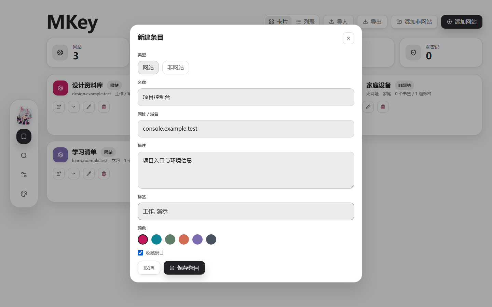

<p align="center">
  
</p>

<h1 align="center">MKey</h1>

<p align="center">本地优先的书签与账号密码保险库。</p>

<p align="center">
  <a href="https://github.com/MKshi1/Mkey/actions/workflows/ci.yml"></a>
  <a href="https://github.com/MKshi1/Mkey/releases/latest"></a>
  <a href="LICENSE"></a>
</p>

MKey 是一款使用 Tauri、React 与 Rust 编写的桌面保险库。它把网站、普通条目、书签和多组账号密码统一保存在本机，不要求注册账号，也不依赖云端服务。

> [!IMPORTANT]
> 当前 GitHub Release 提供的是未签名构建。Windows SmartScreen 或 macOS Gatekeeper 可能显示来源未知提示，请只从本仓库的 Releases 页面下载并自行确认校验来源。

## 界面

### 列表视图



### 卡片视图



### 主题与数据交换



### 条目编辑



截图中的网站、账号和密码均为虚构演示数据。

## 功能

- **网站与普通条目**：网站可以保存书签和账号密码，普通条目适合软件、设备或其他没有网址的账号。
- **多组账密**：一个条目可以保存多组账号、密码、名称和备注。
- **书签管理**：为网站集中保存多个地址，并支持置顶。
- **卡片与列表**：根据数据规模在紧凑列表和卡片布局之间切换。
- **快速搜索**：按名称、域名、标签和账号内容查找条目。
- **密码工具**：生成随机密码、显示弱密码数量，并支持复制账号或密码。
- **本地加密**：保险库锁定后，磁盘文件中不保存可直接阅读的条目内容。
- **浏览器书签导入**：可读取 Chrome、Edge、Firefox 的本地书签，或导入各浏览器导出的 HTML 书签文件；导入前会清洗、去重并显示预览统计。
- **MKey 导入与导出**：通过可移植 JSON 文件迁移完整保险库。
- **四套主题**：墨白极简、杏白暖光、珍珠冷白和霓虹夜色；首次启动使用墨白极简。

## 下载与安装

前往 [Releases](https://github.com/MKshi1/Mkey/releases/latest) 下载适合系统的文件：

| 系统 | 文件 | 说明 |
| --- | --- | --- |
| Windows 10/11 | NSIS `.exe` | 推荐的大多数用户安装包 |
| Windows 10/11 | MSI `.msi` | 适合企业部署或 MSI 工作流 |
| Linux x86_64 | `.AppImage` | 添加执行权限后直接运行 |
| Debian/Ubuntu x86_64 | `.deb` | 使用系统包管理器安装 |
| macOS Apple Silicon | ARM64 `.dmg` | 适用于 M1 及更新芯片 |
| macOS Intel | x64 `.dmg` | 适用于 Intel Mac |

Linux AppImage 首次运行前可能需要执行：

```bash
chmod +x MKey_*.AppImage
```

未签名版本可能触发系统安全提醒。不要从第三方网盘或重新打包站点下载 MKey。

## 开始使用

1. 首次启动时设置至少 8 个字符的主密码，可选填密码提示。
2. 点击“添加网站”保存网站、标签和颜色；点击“添加非网站”保存软件或设备类条目。
3. 在条目中添加书签或多组账号密码。
4. 使用左侧搜索入口查找内容，或在设置页切换主题、导入、导出和锁定保险库。
5. 离开设备前主动锁定保险库；退出程序后，下一次启动需要重新输入主密码。

主密码无法找回。密码提示不会解密保险库，请妥善保管主密码和必要的安全备份。

## 数据与安全

MKey 使用 Rust 后端处理保险库数据：

- 主密码通过 PBKDF2-HMAC-SHA256 派生 256 位密钥，当前迭代次数为 120,000。
- 条目内容使用 AES-256-GCM 加密，并为每次写入生成随机 nonce。
- 每个保险库使用随机 salt；salt、nonce 和密文以 JSON 容器保存在本机。
- 解锁密钥只保留在当前程序会话内，锁定或退出后需要重新输入主密码。
- MKey 不提供云同步、遥测或远程恢复服务。

默认数据位置：

| 系统 | 路径 |
| --- | --- |
| Windows | `%LOCALAPPDATA%\MKey\vault.json` |
| macOS | `~/Library/Application Support/MKey/vault.json` |
| Linux | `$XDG_DATA_HOME/MKey/vault.json` 或 `~/.local/share/MKey/vault.json` |

> [!WARNING]
> 导出的 `mkey-export-YYYY-MM-DD.json` 是便于迁移的明文文件，其中包含账号和密码。请将它视为敏感资料，加密保存或在导入后安全删除，不要上传到 GitHub、网盘公开链接或问题反馈中。

“导入 MKey 数据”会使用文件中的条目替换当前保险库内容。导入前请确认文件来源和内容，并在必要时先做安全备份。

### 浏览器书签导入

设置页的“导入浏览器书签”支持两种来源：本机已发现的 Chrome、Edge、Firefox 书签，以及浏览器导出的 HTML 书签文件。导入流程会先显示可导入、重复、无效和新网站数量；确认后只会合并新的 HTTP/HTTPS 书签，不会替换现有条目，也不会覆盖已有账号密码、备注、颜色或收藏状态。

本功能不会读取浏览器保存的密码、自动填充信息、浏览记录、Cookie 或登录会话。Firefox 的书签库会复制到 MKey 临时目录后以只读方式解析，完成后立即清理临时副本。

## 本地开发

### 环境

- Node.js LTS 与 npm
- Rust stable
- 当前平台所需的 [Tauri 系统依赖](https://v2.tauri.app/start/prerequisites/)

### 运行

```bash
npm ci
npm run tauri dev
```

### 验证

```bash
npm test
npm run build
cargo test --manifest-path src-tauri/Cargo.toml
```

### 构建安装包

```bash
npm run tauri build
```

输出位于 `src-tauri/target/release/bundle/`。正式发布由 GitHub Actions 在各目标系统上原生构建。

## 参与贡献

提交问题或代码前请阅读 [CONTRIBUTING.md](CONTRIBUTING.md)。安全漏洞请按照 [SECURITY.md](SECURITY.md) 私下报告，任何反馈都不要附带真实密码、保险库文件或明文导出。

## 许可证

MKey 使用 [MIT License](LICENSE) 发布。
